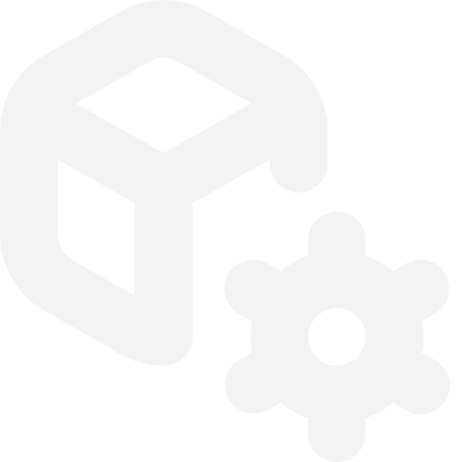

#  **Dependecies Installer**

 

An Easy Anti-Cheat integration sofware.

# **Summary**

[❔ What DependeciesInstaller do](#what-dependecies-installer-do)

[🚀 How to Setup Dependecies Installer](#how-to-setup-dependecies-installer)

# **What Dependecies Installer do?**
Dependecies Installer is a program that allows you to install the necessary components (via a .bat file that you can find in the **presets** folder) to run your game with AntiCheat without any problems for the user of the following: *‘Easy Anti-Cheat not installed ’*, *"Error when opening Easy Anti-Cheat* etc..

# **How to Setup Dependecies-Installer**

To perform a correct and clean setup of DependeciesInstaller, just open the **Configurator** app and choose the game folder for apply this tweak!
